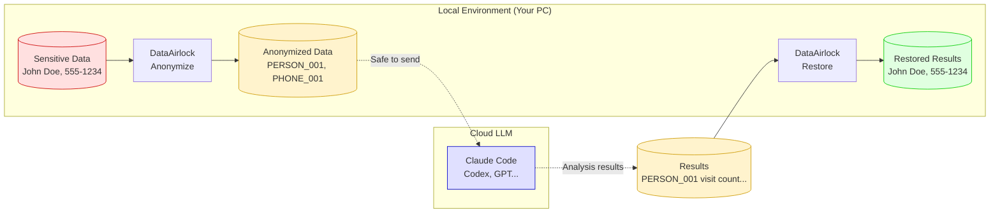

# DataAirlock


**A local tool for safely sharing sensitive data with cloud LLMs**

DataAirlock anonymizes personally identifiable information (PII) locally before sending data to cloud LLMs like Claude Code or Codex. Results can be restored to original data locally.

[日本語ドキュメント](./README.md) | [Report Issues](https://github.com/akira0907/dataairlock/issues)

## Disclaimer

> **This tool does not guarantee 100% detection or anonymization of personal information.**
> Users must verify output data themselves.
> The developers are not responsible for any data leaks or damages resulting from use of this tool.

## Concept



## Features

- **CLI Tool** - Works entirely in terminal, seamlessly integrates with Claude Code and other CLI tools
- **Local Processing** - All anonymization and restoration happens locally; raw data never leaves your machine
- **Semantic IDs** - Meaningful IDs like `PATIENT_001` help LLMs understand context
- **Restorable** - Restore analysis results to original data with one command

## Why DataAirlock?

| Problem | DataAirlock Solution |
|---------|---------------------|
| Can't send sensitive data to cloud | Anonymize locally before sending |
| Anonymized IDs are meaningless | Semantic IDs (PATIENT_001, etc.) help LLMs understand context |
| Manual restoration is tedious | One-command automatic restoration |
| Can't anonymize Word/PPT | Supports CSV, Excel, Word, PowerPoint |

## Quick Start

### Installation

```bash
# Install from GitHub (currently development version)
pip install git+https://github.com/akira0907/dataairlock.git

# Force reinstall to get latest version
pip install --force-reinstall git+https://github.com/akira0907/dataairlock.git

# Or clone and install locally
git clone https://github.com/akira0907/dataairlock.git
cd dataairlock
pip install -e .
```

> In the future, `pip install dataairlock` will be available for easy installation.

### Basic Usage

```bash
# 1. Create workspace (anonymize files)
dataairlock workspace ./my_project --add data/patients.csv -p mypassword

# 2. Launch Claude Code (work with anonymized data)
dataairlock wrap ./my_project --shell
# or
cd ./my_project/.airlock && claude

# 3. Restore results
dataairlock workspace ./my_project --restore-all -p mypassword
```

### Integration with Claude Code

```bash
# Launch interactive shell (work inside .airlock/)
dataairlock wrap ./my_project --shell

# Launch Claude Code directly
dataairlock wrap ./my_project -c "claude"

# Run script with auto-restore
dataairlock wrap ./my_project -c "python analyze.py" --auto-restore -p mypassword
```

## Supported PII Types

| PII Type | Anonymized Format | Example |
|----------|------------------|---------|
| Patient ID | PATIENT_001 | P001 → PATIENT_001 |
| Name | PERSON_001 | John Doe → PERSON_001 |
| Phone Number | PHONE_001 | 555-123-4567 → PHONE_001 |
| Email | EMAIL_001 | test@example.com → EMAIL_001 |
| Address | ADDR_001 | 123 Main St... → ADDR_001 |
| Date of Birth | 1990s (generalized) or BIRTHDATE_001 | 1990/01/15 → 1990s |
| Age | 30s (generalized) or AGE_001 | 34 → 30s |

## Commands

| Command | Description |
|---------|-------------|
| `workspace --add` | Anonymize and add file to workspace |
| `workspace --add-all` | Batch add all files in folder |
| `workspace --status` | Show workspace status |
| `workspace --restore` | Restore result file |
| `workspace --restore-all` | Batch restore all CSVs in output/ |
| `wrap` | Execute command in anonymized environment |
| `chat` | Chat with local LLM (Ollama) |
| `scan` | Detect PII only (no anonymization) |
| `anonymize` | Anonymize single file |
| `restore` | Restore single file |
| `scan-doc` | Detect PII in Word/PPT |
| `anonymize-doc` | Anonymize Word/PPT |
| `restore-doc` | Restore Word/PPT |
| `profile list` | List saved profiles |
| `profile show` | Show profile details |
| `profile delete` | Delete a profile |
| `profile export` | Export profile to JSON |
| `profile import` | Import profile from JSON |
| `profile create-default` | Create default profile |

## Anonymization Strategies

| Strategy | Description | Use Case |
|----------|-------------|----------|
| `replace` | Replace with semantic ID (restorable) | Names, patient IDs, phone numbers |
| `generalize` | Generalize (decade, prefecture, etc.) | Birth date → decade, address → prefecture |
| `delete` | Delete entire column | Unnecessary PII columns |

## PII Detection Modes

DataAirlock supports three detection modes:

| Mode | Description | Features |
|------|-------------|----------|
| `rule` | Rule-based (regex) | Fast, works offline, default |
| `llm` | LLM (Ollama) only | High accuracy, detects ambiguous PII |
| `hybrid` | Rule + LLM combined | Best accuracy, recommended |

### CLI Usage

```bash
# Rule-based (default)
dataairlock scan data.csv

# LLM mode
dataairlock scan data.csv -m llm

# Hybrid mode (recommended)
dataairlock scan data.csv -m hybrid

# Also available for anonymize
dataairlock anonymize data.csv -m hybrid -p mypassword
```

### TUI Usage

In TUI, when processing folders, you'll be asked "Use LLM to improve PII detection accuracy?"
Select "Yes" to choose a detection mode.

### Ollama Setup

LLM mode requires Ollama:

```bash
# macOS
brew install ollama

# Linux
curl -fsSL https://ollama.ai/install.sh | sh

# Start server
ollama serve

# Download model
ollama pull llama3.1:8b
```

## Profile Feature

Save PII processing settings as profiles to reuse in future work.
This eliminates repetitive configuration for routine tasks (e.g., monthly patient data processing).

### TUI Usage

When PII is detected in TUI, you can choose to use a profile:

```
Use a profile?
  > 📋 Use existing profile
    ✨ New settings (can save as profile)
    ⏭️ One-time settings (don't save)
```

### CLI Usage

```bash
# List saved profiles
dataairlock profile list

# Create default profile
dataairlock profile create-default

# Show profile details
dataairlock profile show medical_data

# Share with team (export/import)
dataairlock profile export medical_data -o ./medical_profile.json
dataairlock profile import ./medical_profile.json
```

### Profile Storage Location

```
~/.config/dataairlock/profiles/
├── default.json
├── medical_data.json
└── hr_data.json
```

## Directory Structure

```
my_project/
├── .airlock/                    # Workspace (Git-safe)
│   ├── data/                    # Anonymized data
│   │   └── patients.csv         # PATIENT_001, PERSON_001...
│   ├── output/                  # LLM output directory
│   ├── PROMPT.md                # LLM prompt template
│   └── README.md
├── .airlock_mappings/           # Mapping files (NOT Git-safe)
│   └── patients.mapping.enc     # Encrypted mapping
└── results/                     # Restored results
    └── analysis.csv             # John Doe, 555-123-4567...
```

## Security

- **Encrypted Mapping Files**: Encrypted with Fernet (AES-128-CBC)
- **Password Required**: Password needed for restoration
- **Local Processing (No Data Exfiltration)**: **All anonymization and restoration is performed locally. Raw data is never sent to the cloud.**
- **Git Exclusion**: `.airlock_mappings/` is automatically added to `.gitignore`

## Requirements

- Python 3.10+
- Ollama (only for chat command)

## Development

```bash
# Clone
git clone https://github.com/akira0907/dataairlock.git
cd dataairlock

# Setup development environment
python -m venv .venv
source .venv/bin/activate
pip install -e ".[dev]"

# Run tests
pytest
```

## License

AGPL-3.0

## Author

[@akira0907](https://github.com/akira0907)
